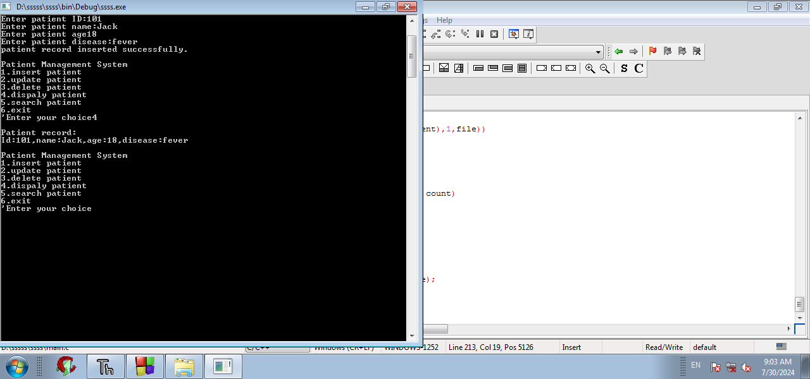
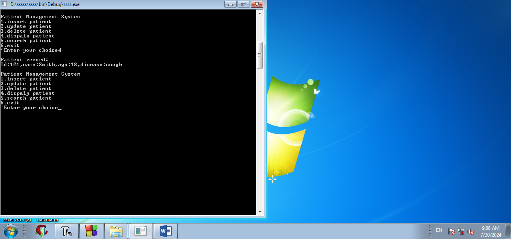
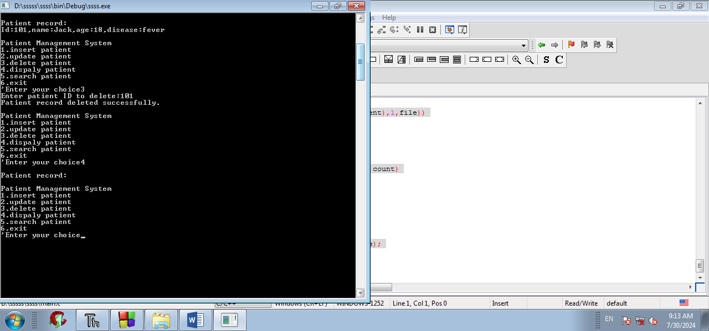
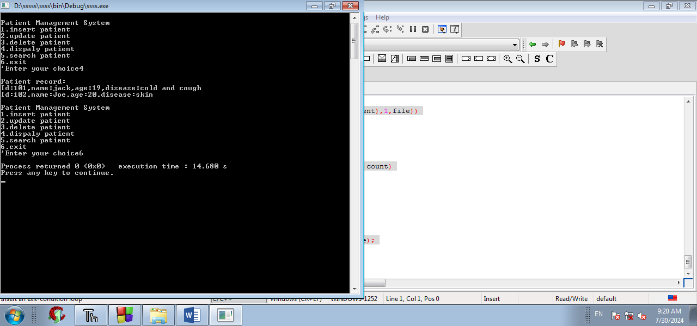

# Patient Management System (C)

A menu-driven console application written in C that manages patient records. Records are saved in a binary file, so data stays available after the program closes.

Built as a project at Disha Computer Institute, Solapur.

## Features

- Insert a new patient record (ID, name, age, disease)
- Update an existing patient's name and disease by ID
- Delete a patient record by ID
- Display all patient records
- Search for a patient by ID
- Permanent storage using file handling (`patients.dat`)

## Concepts Used

- Structures (`struct`)
- Binary file handling (`fopen`, `fread`, `fwrite`, `fclose`)
- Arrays and functions
- Menu-driven programming with `switch` and loops

## How to Run

```bash
gcc main.c -o patient
./patient
```

On Windows, run `patient.exe` instead of `./patient`.

## Menu

```
Patient Management System
1. Insert patient
2. Update patient
3. Delete patient
4. Display patients
5. Search patient
6. Exit
```

## Screenshots








## Limitations

- Handles up to 100 records at a time in memory
- Records are found by ID only

## Author

Zona Sameer Rangrez
B.Tech CSE (AI & Data Science)
